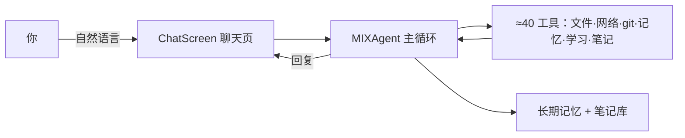

# MIX

> 把"一个能自己调工具的 AI 助手"装进手机。纯 Dart 写的通用 Agent，跑在 Android 上——聊天就能让它读写文件、联网查资料、记笔记、出考题、跑多代理。不绑桌面，不绑云端账号。

[](https://github.com/ZhengJL18/MIX/actions/workflows/build-apk.yml)
[](https://flutter.dev)
[](https://github.com/NousResearch/hermes-agent)
[](./LICENSE)

**MIX 是 [Hermes Agent](https://github.com/NousResearch/hermes-agent) 的纯 Dart 复刻**：在 Flutter 沙盒里用 Dart 逐文件重写其核心闭环，把"会自己调工具的 AI"塞进一个 APK。它不是又一个聊天机器人，而是一个能在你手机上真干活的通用智能体。

## 为什么是 MIX

- **通用，不是玩具** — 自然语言下指令就能干真实任务：改文件、搜网页、跑 git、记笔记、出题、定时任务。≈40 个内置工具，全部走统一注册协议。
- **长期记忆** — 中文分词 + 知识图谱 + 置信度引擎，越用越懂你；笔记会自动进记忆，可被检索、联想。
- **学习模式** — 刷题不用换 App：左右滑做题、AI 即时讲解，掌握度按近 15 题正确率自动跟踪，生成你的学科画像。
- **内置笔记库** — Obsidian 式 Markdown 笔记，和 Agent 共用目录；你写过的笔记它读得到，它写的笔记你看得到。
- **多代理协作** — 一个复杂任务拆给子代理 / 部门 / MoA 辩论，失败互相隔离。
- **纯 Dart 原生** — 没有嵌入式 Python，APK 更轻；Android 为主战场，Linux 桌面版已停更。

## 它怎么干活



## 快速开始

### 直接用（推荐）
从 [Releases](https://github.com/ZhengJL18/MIX/releases) 下载最新 APK，装到 Android。首次打开填一个 LLM Key（DeepSeek / 通义 / OpenAI / Kimi / 智谱 / Gemini …任选）即可开聊。

### 自己构建
```bash
flutter pub get
flutter build apk --release
```
需要 Flutter `^3.12.2`。

## 怎么用
打开就是聊天页。顶部菜单：
- **切工作流**：`coding` / `research` / `daily` / `company` / `study` —— 切换 Agent 的人设与工具集
- **进笔记库**：Obsidian 式 Markdown 笔记
- **设置**：模型、主题（5 套）、「所有文件访问」权限

开启**计划模式**后 Agent 先只读探索、出计划，你批准才动手；**思考强度**可逐流程独立调。

## 能力速览

| 能力 | 说明 |
|------|------|
| Agent 闭环 | 自动重试 / 上下文压缩 / 防死循环 / 跨重启恢复会话 |
| 工具 | 文件·网络·记忆·任务·技能·委派·git·学习·笔记·文档转换·定时任务 |
| 记忆 | 多记忆文档 + 知识图谱 + 置信度 + 目标系统 + 自进化（refine） |
| 学习 | StudyEngine 掌握度 + `study_quiz` 滑动题卡 + 学科画像 |
| 笔记 | printnotes，教材导入，mermaid 图 |
| 多代理 | 子代理 / 部门执行 / MoA 讨论 |
| 工程 | 重活丢 isolate 防卡 UI；云端保险柜；国内镜像自动更新 |

> 想深入实现（工具注册协议、记忆子系统 v4 设计、复刻映射）？见下方「文档」。

## 文档
- `docs/HERMES_MAPPING.md` — Hermes → Dart 复刻映射表（权威）
- `docs/HANDOFF.md` — 交接说明（进度 / 约定 / 踩坑）
- `AGENTS.md` — 给 AI 协作者 / 接手开发者的维护约定

## 复刻声明
MIX 以 [NousResearch/hermes-agent](https://github.com/NousResearch/hermes-agent) 为唯一行为规范，用 Dart 逐文件重写其核心闭环，不自创工具系统。

## Contributing
欢迎贡献。改动前请先读 `AGENTS.md`（维护约定）与 `docs/HANDOFF.md`（进度与踩坑）。

## License
本项目基于 [MIT License](./LICENSE) 开源，欢迎使用、修改与分发。
